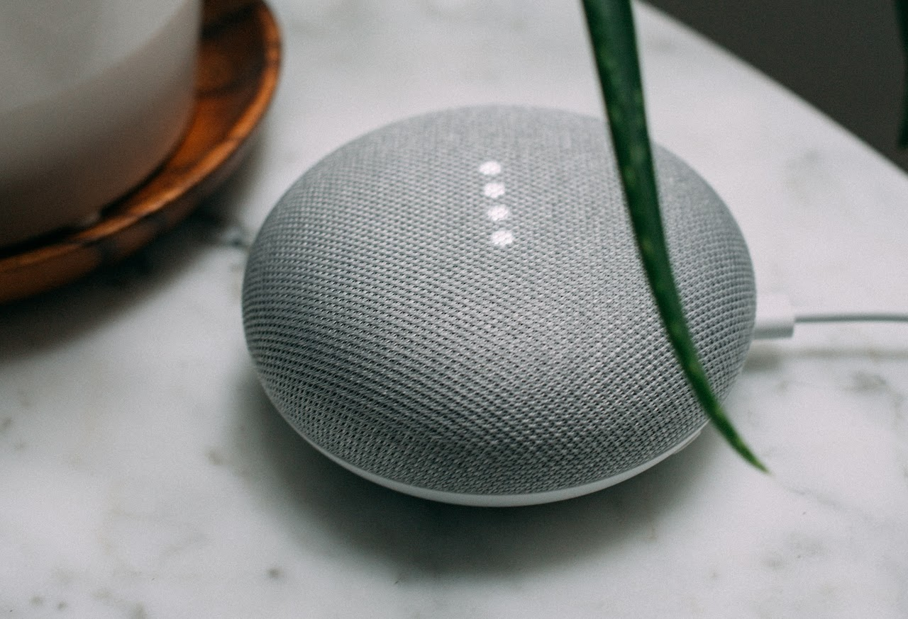

# Mais ferramentas digitais

Os assistentes fazem uso de inteligência artificial e da vasta informação disponível na internet para te fornecer respostas às coisas mais triviais que possa imaginar, como:

_(Nota 1 : Nas linhas de conversação a tradução das rases em francês é representada pelo símbolo_ 🌐 _na linha logo abaixo)_

    🗨️ Quel temps fait il ?

    🌐 Como está o tempo ?

    🗨️ Quelle heure est-il?

    🌐 Que horas são ?

    🗨️ Quelle est la distance entre la terre et la lune ?

    🌐 Qual é a distância entre a terra e a lua ?

    🗨️ Raconte moi une blague

    🌐 Me conte uma piada

Isso significa que além tornar a vida mais fácil, eles também podem auxiliar com uma área que geralmente não é explorada. O Aprendizado de idiomas. Veja que ao interagir com o assistente em francês, você tem a oportunidade de criar um hábito de conversação que com o tempo irá fluir naturalmente. Pois se no hoje você gostaria de saber se irá chover, amanhã talvez queira saber a receita de um bolo de laranja.

Mas, e se eu não sei como perguntar qual é receita de um bolo de laranja em Francês ? Não importa, pois, basta perguntar ao assistente... como perguntar ao assistente, veja:

_(Nota 2: Neste exemplo estarei usando o Google Assistente, que é representado nas linhas de conversação pelo simbolo:_ 📱 _)_

_(Nota 3: Todas as conversações com o Google Assistente são iniciadas com uma palavra chave (hot word). Essa palavra indica para o dispositivo que o usuário gostaria de fazer uma pergunta, e a partir daí o dispositivo começa a ouvir e transcrever o diálogo. No caso do Google Assistente a palavra chave é_ _**Okay Google**__)_

_(Nota 4: Opcionalmente, pode-se habilitar o modo de conversação do assistente do Google, que fica ouvindo por mais 8 segundos após a primeira interação. Essa função é ótima para continuar interagindo mais naturalmente sem precisar ficar repetindo a palavra chave.)_

    🗨️ Okay Google, Como se fala _receitas de Bolo de Laranja, em francês ?_

    📱 Em francês: recettes de gâteau à l'orange

Em seguida faço a pergunta já em francês, repetindo o que o Google Assistente havia pronunciado. (Logo abaixo de cada frase, listo a tradução mecanizada fornecida pelo [Google Tradutor](https://translate.google.com/#view=home&op=translate&sl=fr&tl=pt&text=%F0%9F%93%B1%20D%27accord.%0A%F0%9F%93%B1%20J%27ai%20une%20recette%20de%20Cake%20%C3%A0%20l%27orange%20sur%20Marmiton.%0A%F0%9F%93%B1%20C%27est%20une%20recette%20pour%206%20personnes%20qui%20demande%20environ%20une%20heure%20et%20vingt%20minutes%20de%20pr%C3%A9paration.%0A%F0%9F%93%B1%20%C3%87a%20vous%20va%E2%80%AF%3F))

    🗨️ Okay Google, recettes de gâteau à l'orange

    📱 D'accord.

    🌐 _Okay_

    📱 J'ai une recette de Cake à l'orange sur Marmiton.

    🌐 _Tenho uma receita para o bolo de laranja em Marmiton (um site de receitas)

    📱 C'est une recette pour 6 personnes qui demande environ une heure et vingt minutes de préparation.

    🌐 _Esta é uma receita para 6 pessoas que leva cerca de uma hora e vinte minutos para se preparar._

    📱 Ça vous va ?

    🌐 _Tudo bem?_

- _[_Marmiton_](https://www.google.com/url?q=https%3A%2F%2Fwww.marmiton.org%2F&sa=D&sntz=1&usg=AFQjCNG-xmqLLkoYbqTexvY2Z5BWld_uhQ) é um site de receitas veja uma curiosidade_ [_aqui_](https://www.google.com/url?q=https%3A%2F%2Fsites.google.com%2Fview%2Fumajornadaaprendendofrances%2Fnotas%2Fcoisasquedescobriestudandofrances%3Fauthuser%3D0%23h.h40uja28894u&sa=D&sntz=1&usg=AFQjCNEBNklejfCn7HmXo_c1uhLEZ3dgqQ)_)

Mas e se a resposta foi dita muito rápido ?

Ou não entendi as palavras pronunciadas ?

Nesse caso basta pedir ao assistente que repita novamente porém, mais devagar.

E para facilitar pode ainda, pegar a transcrição do texto exibida pelo assistente no painel de configurações.

No caso do Google assistente, acesse o [Google Minhas Atividades](https://myactivity.google.com/) e filtre por Assistente ou acesse [diretamente aqui](https://myactivity.google.com/item?product=31)

Enquanto é verdade, que alguns assistentes podem fazer tradução simultânea em tempo real de uma conversação. A ideia, assim como no artigo anterior, orbita em torno de criar um ambiente no qual o uso do idioma seja incentivado. Neste pequeno exemplo fornecido, podemos gerar situações de diálogo e tutoria. Ao invés de utilizar a ferramenta como interprete em uma conversa.

